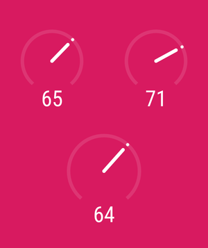

# MisMeter

[](https://jitpack.io/#yongjhih/mismeter)
[](https://jitpack.io/com/github/yongjhih/mismeter/-SNAPSHOT/javadoc/)
[](https://travis-ci.org/yongjhih/mismeter)
[](https://coveralls.io/github/yongjhih/mismeter)

<!--[](https://gitter.im/yongjhih/mismeter)-->
<!--[](https://codacy.com/app/yongjhih/mismeter)-->
<!--[](https://bintray.com/yongjhih/maven/mismeter/_latestVersion)-->




## Usage

```xml
<com.github.yongjhih.MisMeter
    android:id="@+id/meter"
    android:layout_width="200dp"
    android:layout_height="200dp"
    />
```

```java
final MisMeter meter = (MisMeter) findViewById(R.id.meter);
meter.setProgress(0.8f);
```

or

```java
ValueAnimator anim = ValueAnimator.ofFloat(meter.progress, 0.8f);
anim.setInterpolator(new AccelerateDecelerateInterpolator());
anim.setDuration(500);
anim.addUpdateListener(new ValueAnimator.AnimatorUpdateListener() {
    @Override
    public void onAnimationUpdate(ValueAnimator valueAnimator) {
        meter.setProgress((float) valueAnimator.getAnimatedValue());
    }
});
anim.start();
```

## Stylable

* `app:show_text="true"`

## Installation

```gradle
repositories {
    jcenter()
    maven { url "https://jitpack.io" }
}

dependencies {
    compile 'com.github.yongjhih:mismeter:1.0.0'
}
```

## LIVE DEMO

* https://appetize.io/app/g2y4p5z5utu40d3zf1a71puzec

## LICENSE

Copyright 2016 Andrew Chen

Licensed under the Apache License, Version 2.0 (the "License"); you may not use this file except in compliance with the License. You may obtain a copy of the License at

http://www.apache.org/licenses/LICENSE-2.0

Unless required by applicable law or agreed to in writing, software distributed under the License is distributed on an "AS IS" BASIS, WITHOUT WARRANTIES OR CONDITIONS OF ANY KIND, either express or implied. See the License for the specific language governing permissions and limitations under the License.
